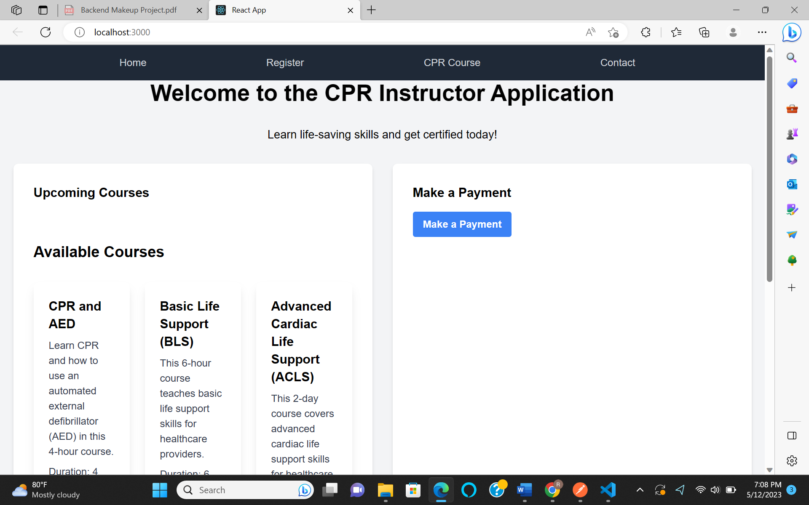
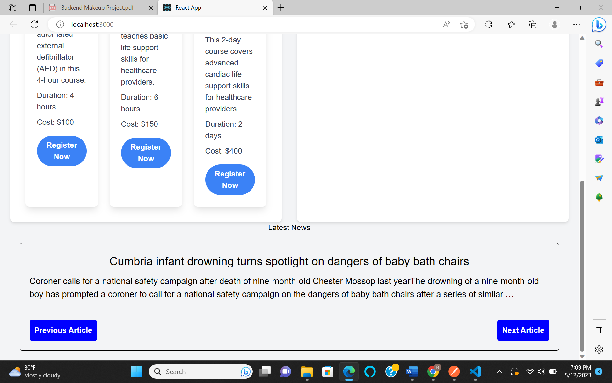
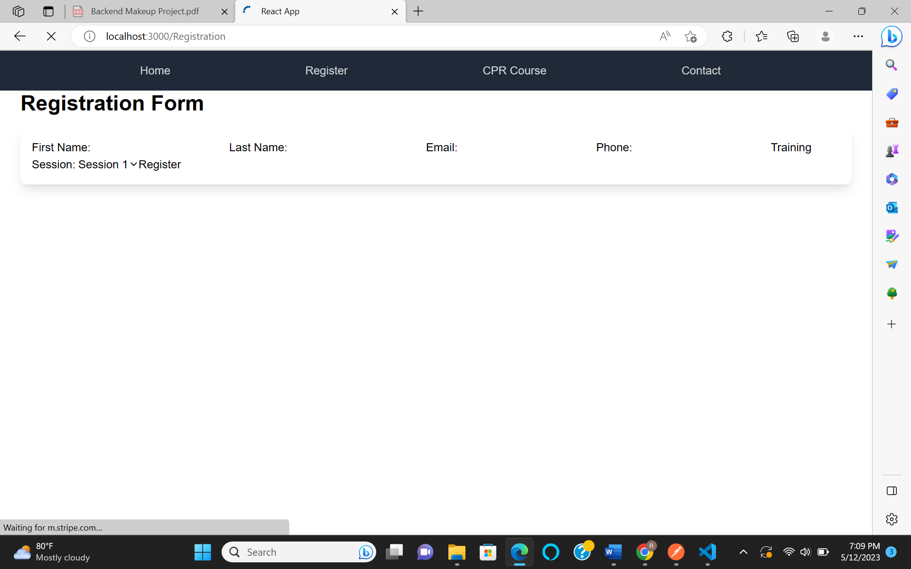
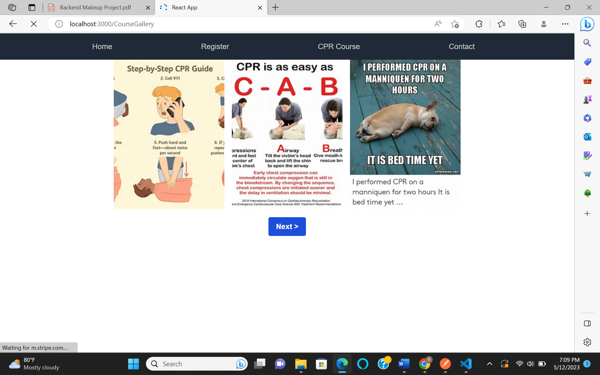

# CPR-Instructor-Application

## User Story
As a CPR instructor, I want to offer online courses to my clients so they can learn CPR in a convenient and accessible way. I want to be able to manage my courses and track my clients' progress through an easy-to-use interface.

## Project Description
The CPR Instructor Application is a web application built using React, Redux, React Router, and Tailwind CSS. The application allows CPR instructors to manage their courses and offer online courses to their clients. It provides the following features:

- User authentication: Instructors can register and log in to their accounts.
-Course creation and management: Instructors can create and manage CPR courses, including course details and pricing.
- Client management: Instructors can track and manage their clients, including enrollment and progress tracking.
- Payment processing: The application integrates with Stripe for secure payment processing.

## Installation
1. Clone this repository: [CPR-Instructor-Application](https://github.com/Doylej16/CPR-Instructor-Application)

2. Run `npm install` to install the dependencies
3. Cd cpr-instructor3
3. Run `npm start` to start the application

## Technologies Used
- React
- Redux
- React Router
- Tailwind CSS
- Stripe
- React-Dom
-React-Router-Dom

## Screenshots

## Contributing
Pull requests are welcome. For major changes, please open an issue first to discuss what you would like to change.

## License
MIT
